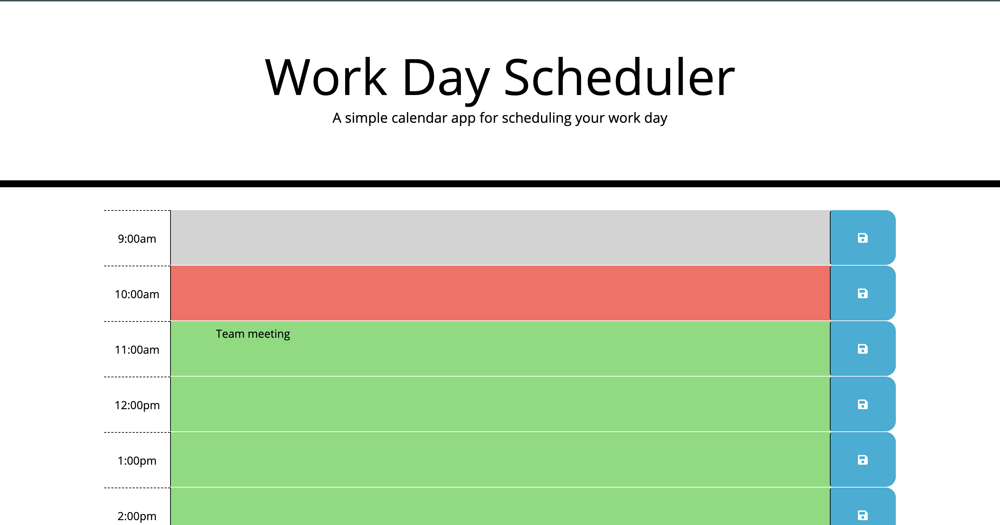
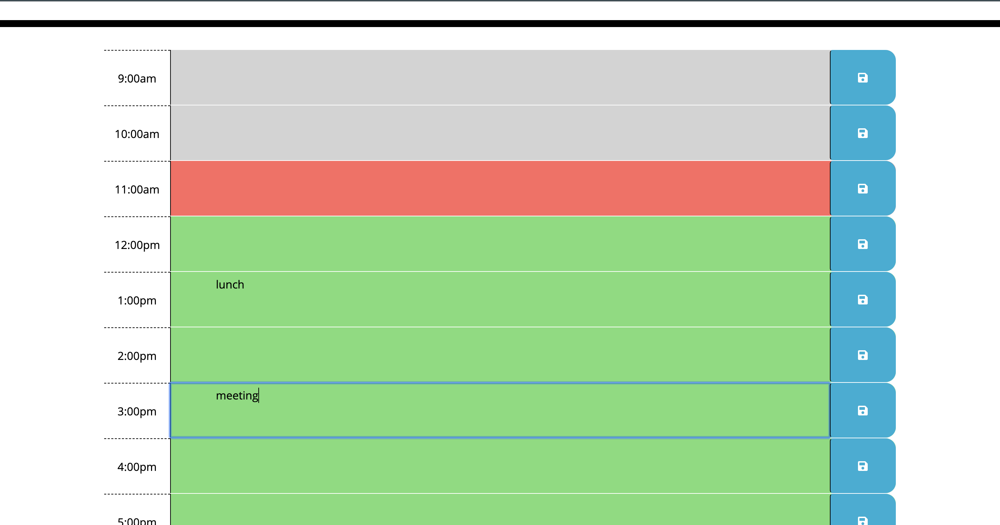

# Work Day Scheduler

## Overview
A simple day planner application that allows the user to save events for each hour of their standard work day. This application will run in the browser and feature dynamically updated HTML and CSS powered by JQuery. Application is responsive, ensuring adaptation to multiple screen sizes.

## Features

* The application display's standard business hours (9 a.m. to 5 p.m.).

* Each time slot should represent one hour and contain the following:
  * The time
  * A field to hold user input
  * A save button

* Depending on the time of day, the schedule input fields update their color indicating to the user whether items are in the past, present or future. 

* Clicking on the save button will store the time and user input in localStorage.

* You'll need to use the Moment.js library to work with date and time.

You can run this Application [here](https://karpagasathya.github.io/hw5_workday_scheduler/)

## Screenshots

